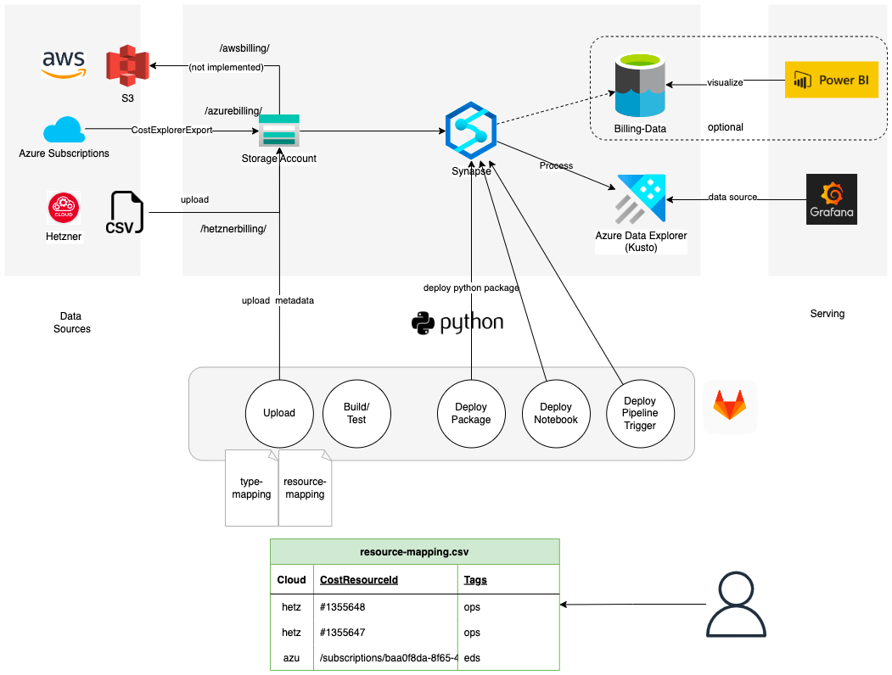

# CloudBillingTool



```
git clone .
```
## Run CloudBillingTool as cli
```
usage: cloudbillingtool-run.py [-h] [--hetzner_data HETZNER_DATA] [--azure_data AZURE_DATA] [--aws_data AWS_DATA] [--metadata METADATA] [--output_path OUTPUT_PATH]

optional arguments:
  -h, --help            show this help message and exit
  --hetzner_data HETZNER_DATA
                        Path to Hetzner data files
  --azure_data AZURE_DATA
                        Path to Azure data files
  --aws_data AWS_DATA   Path to AWS data files
  --metadata METADATA   Path to metadata (mapping files) directory
  --output_path OUTPUT_PATH
                        Path to output directory

```
## Run CloudBillingTool via docker

The following code will build a docker container (standalone). It needs the data mounted (eg. azure  blob storage or locally) and also the output folder
```
# build image
docker build -t cloudbillingtool ./

# run the container
bash docker-run.sh
#or
docker run --name cloudbillingtool -v ${PWD}/tests/data/:/data/ -v ${PWD}/tests/metadata/:/metadata/ -v /tmp/output/:/output/ cloudbillingtool

# cleanup
dockdocker stop cloudbillingtool; docker rm cloudbillingtool;  
```

## Setup CloudBillingTool with Synapse
Azure Synapse Analytics is a fully managed, cloud-based analytics platform that allows users to ingest, prepare, manage, and serve data for immediate business intelligence and machine learning needs. It provides a unified experience for data integration and analytics by allowing us to query data using familiar T-SQL and also leveraging built-in connectors and integration with other Azure services. It also provides both serverless and provisioned options, which allows users to scale their usage and costs based on their specific needs.


Synapse (notebook, pipeline, trigger)
Data Epxlorer (Kusto)
Grafana

### Deploy Infrastructure to Azure
```
git clone terraform-repo
terraform init
terraform plan
terraform validate
terraform apply
```

### Install CloudBillingTool to Azure Synapse


### Setup Grafana with Kusto Connection
Tbd


## Setup CloudBillingTool with K8s


# Development 
## Build
```
python setup.py bdist_wheel
```

## Run tests
```
python3 -m unittest
```

## Load the unified Schema via pySpark into your code

You can use the following python code to process the data in a separate pyspark app
```
all_bills_schema = StructType() \
    .add("Provider",StringType(), True) \
    .add("ProductName",StringType(), True) \
    .add("Date",DateType(), True) \
    .add("Costs",DecimalType(), True) \
    .add("UnitPrice",DecimalType(), True) \
    .add("Quantity", DecimalType(), True) \
    .add("CostResourceId",StringType(), True) \
    .add("CostResourceTag", ArrayType(StringType()), True)
  
    spark.read\
    .options(format='csv', escape="\"", header=False)\
    .schema(all_bills_schema)\
    .csv("path/to/data")
  ```