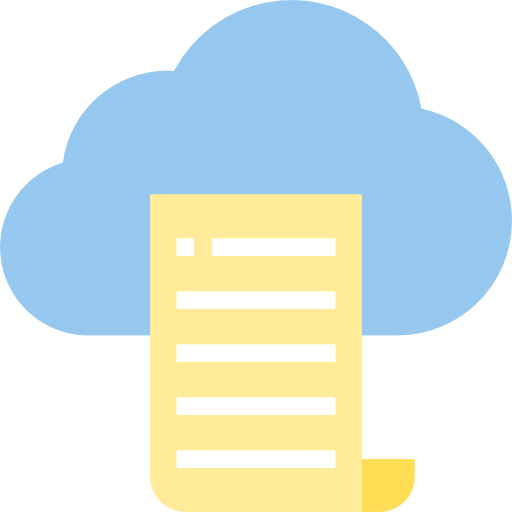

<!-- PROJECT LOGO -->
<br />
<div align="center">
  
  <h2 align="center" style="text-align: center;">Cloud Billing Tool</h2>
  <p align="center">
   Unify Your Cloud Costs, Simplify Your Bill Management with our Cloud Billing Tool
  </p>
</div>


<!-- TABLE OF CONTENTS -->
<details>
  <summary>Table of Contents</summary>
  <ol>
    <li><a href="#architecture">Architecture</a></li>
    <li><a href="#Overview-of-the-Key-Components">Overview of the Key Components</a></li>
     <li><a href="#requirements">Requirements</a></li>
    <li><a href="#installation">Installation</a></li>
    <li><a href="#limitation">Limitation</a></li>
  </ol>
</details>


## Architecture
<div align="center">

</div>


## Overview of the Key Components

**Azure Synapse Analytics** is a fully managed, cloud-based analytics platform that allows users to ingest, prepare, manage, and serve data for immediate business intelligence and machine learning needs. 

**Azure Synapse Studio Notebooks** is a feature of Azure Synapse Analytics that allows us to create, edit, and run Jupyter notebooks within the Azure Synapse Studio environment.

**In Azure Synapse, pipelines** are a fundamental building block for creating and organizing data integration and data flow workflows.

**Triggers** in Synapse pipelines determine when a particular pipeline(s) should be run.

**Azure Data Explorer** is a fully managed, high-performance, big data analytics platform that makes it easy to analyze high volumes of data in near real time.

**Kusto Query Language (KQL)** is the query language used by Azure Data Explorer(ADX) to retrieve and analyze data stored in the service.


**Grafana** is an open-source platform for data visualization and monitoring. It provides a powerful and flexible way to create, explore, and share dashboards and metrics with a wide range of data sources.

 ## Requirements
  CloudBilling Tool assume that the Hetzner Data format should be formatted. To validate the data it should pass the following script 'hetzner_fix_data.py'.Please check this file for further instructions. 

## Installation

Please clone the repo of CloudBilling Tool.

```
git clone https://gitlab.com/rocket9-code/customers/senec/cloudbillingtool-app.git
```
## Run CloudBillingTool as cli
```
usage: cloudbillingtool-run.py [-h] [--hetzner_data HETZNER_DATA] [--azure_data AZURE_DATA] [--aws_data AWS_DATA] [--metadata METADATA] [--output_path OUTPUT_PATH]

optional arguments:
  -h, --help            show this help message and exit
  --hetzner_data HETZNER_DATA
                        Path to Hetzner data files
  --azure_data AZURE_DATA
                        Path to Azure data files
  --aws_data AWS_DATA   Path to AWS data files
  --metadata METADATA   Path to metadata (mapping files) directory
  --output_path OUTPUT_PATH
                        Path to output directory

```
## Run CloudBillingTool via docker

The following code will build a docker container (standalone). It needs the data mounted (eg. azure  blob storage or locally) and also the output folder
```
# build image
docker build -t cloudbillingtool ./

# run the container
bash docker-run.sh
#or
docker run --name cloudbillingtool -v ${PWD}/tests/data/:/data/ -v ${PWD}/tests/metadata/:/metadata/ -v /tmp/output/:/output/ cloudbillingtool

# cleanup
dockdocker stop cloudbillingtool; docker rm cloudbillingtool;  
```

## Setup CloudBillingTool with Synapse


### Deploy Infrastructure to Azure
```
git clone terraform-repo
terraform init
terraform plan
terraform validate
terraform apply
```

### Setup Grafana with Kusto Connection
1. Select 'App Registrations' service from your Azure Portal.
2. Select '+New Registration'  and Give the name of your application e.g. 'SenecBillingAppV2' and click the button 'Registration.
3. Please note the following values,APPLICATION(Client)ID and DIRECTORY(Tenant) ID from the 'App Registrations' page.
4. Navigate to 'Certificates&Secrets' which is on the left side of the page 'SenecBillingAppV2'.
5. Click '+ New Client Secret' and this will open a window. Fill up the form according to your custom name and click the button 'Add'. This will create a Secret Key and Value.Save the 'Secret value'.
6. Navigate to the Azure Cluster created by Terraform.
7. Select the database and navigate to the 'Permission' and give viewer permission to your application created in step 2.
8. Go to your 'Grafana Account' and then select 'Configuration'.
9. Select 'Plugins' Tab and Search for the plugin 'Azure Data Explorer Data Source'.Install it.
10. Now select 'Data Sources' Tab and write 'Azure Data Explorer Data Source' in the search bar.Press 'Add Data Source' button.This will open 'Data Sources / Azure Data Explorer Datasource' page.
11. Set the name 'cloudbillingsenecGrafanaV1' because dashboard will be using this same name.If you use our own custom name,you have to  update the dashboard's datasource and point it to your own 'Data Source Name.
12. Navigate to the Azure Data Explorer Web UI via the Azure Portal. The AAD application that you created in step 2 needs to be given viewer access to your Azure Data Explorer database. This is done using the dot command.
```
.add database [our_db_name] viewers (‘aadapp=[our_client_id(values from step 3);our_tenant_id(values from step 3)’)
```
13. Navigate back to your Grafana's page 'Data Sources / Azure Data Explorer Datasource' and scroll down.Stop at the section 'Connection Details'.

14. Fill up the forms as below : 
    1. Azure Cloud : Azure
    2. Cluster URL : (CLUSTER_URL_OF_OUR_YOUR_CLUSTER)
    3. Tenant ID : (TENANT_ID/DIRECTORY_ID-values from step 3)
    4. Client ID:  (APPLICATION_ID/SERVICE_PRINCIPLE_ID - values from step 3)
    5. Client Secret : (PASSWORD_CREATED_IN_STEP-This is the 'Secret Value' from the step 5)

15. Scroll down and stop at the section 'Default Schema Settings'.Select 'Default Database' dropdown and if the step 14 is successful you will see the name of the database from your 'Azure Data Explorer Cluster'.

16. Select the database and press 'Save&Test' Button.

17. Navigate Back to the 'Billing Dashboard' and you will see our visualization.
  

## Setup CloudBillingTool with K8s


# Development 
## Build
```
python setup.py bdist_wheel
```

## Run tests
```
python3 -m unittest
```

## Load the unified Schema via pySpark into your code

You can use the following python code to process the data in a separate pyspark app
```
all_bills_schema = StructType() \
    .add("Provider",StringType(), True) \
    .add("ProductName",StringType(), True) \
    .add("Date",DateType(), True) \
    .add("Costs",DecimalType(), True) \
    .add("UnitPrice",DecimalType(), True) \
    .add("Quantity", DecimalType(), True) \
    .add("CostResourceId",StringType(), True) \
    .add("CostResourceTag", ArrayType(StringType()), True)
  
    spark.read\
    .options(format='csv', escape="\"", header=False)\
    .schema(all_bills_schema)\
    .csv("path/to/data")
  ```

 